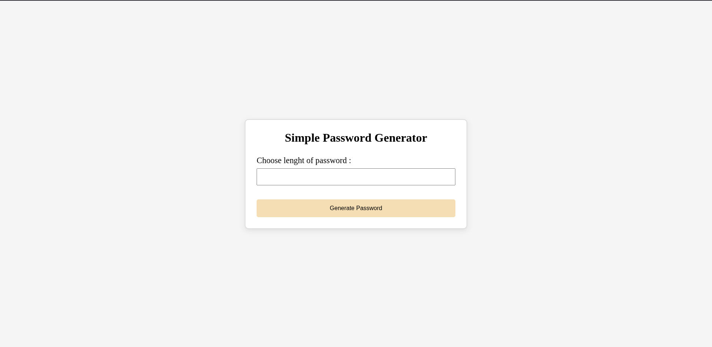
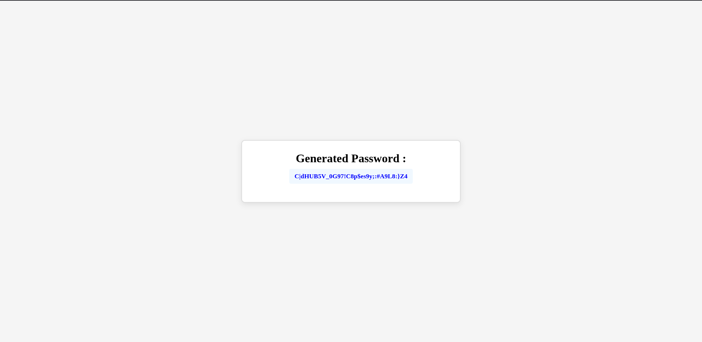

# 🔐 Password Generator Web Application

A secure and user-friendly **Password Generator Web Application** built using **Python** and **Django**. This application enables users to generate strong, customizable passwords through a clean web interface, helping improve password security for personal and professional use.

---

## 📖 Overview

Weak passwords are one of the leading causes of compromised online accounts. This project provides an easy way to generate strong, random passwords based on user selected criteria.

Users can customize:

- Password length
- Uppercase letters
- Lowercase letters
- Numbers
- Special characters

The application instantly generates a secure password based on the selected options.

---

## ✨ Features

- Secure random password generation
- Custom password length
- Include or exclude:
  - Uppercase letters
  - Lowercase letters
  - Numbers
  - Special characters
- Simple and responsive user interface
- Built with Django following the MVT architecture
- Lightweight and easy to deploy

---

## 🛠️ Tech Stack

| Technology | Purpose |
|------------|---------|
| Python | Backend Programming |
| Django | Web Framework |
| HTML5 | Page Structure |
| CSS3 | Styling |

---

## 🚀 Installation

### 1. Clone the repository

```bash
git clone https://github.com/esistdini/passwordGenerator
```

### 2. Navigate into the project

```bash
cd passwordGenerator
```

### 3. Create a virtual environment

**Windows**

```bash
python -m venv venv
venv\Scripts\activate
```

**Linux / macOS**

```bash
python3 -m venv venv
source venv/bin/activate
```

### 4. Install dependencies

```bash
pip install -r requirements.txt
```

### 5. Run migrations

```bash
python manage.py migrate
```

### 6. Start the development server

```bash
python manage.py runserver
```

### 7. Open in your browser

```
http://127.0.0.1:8000/
```

---

## 💡 How It Works

1. Open the application.
2. Select the desired password length.
3. Choose the character types to include.
4. Click **Generate Password**.
5. Copy the generated password for use.

---

## 📸 Screenshots

### Home Page 



### Output page 



---

## 📚 Learning Objectives

This project was built to strengthen understanding of:

- Django project structure
- Django Views
- URL Routing
- Template Rendering
- Static File Management
- Form Handling
- Python's random and string modules
- Web application development fundamentals

---

## 🔄 Version Control

### Version 1.0
- Initial release as a **Command Line Interface (CLI)** password generator.
- Generated secure passwords through terminal input.

### Version 2.0
- Migrated the CLI application into a full **Django Web Application**.
- Added an interactive web interface.
- Improved usability and accessibility.
- Implemented Django views, templates, and URL routing.
- Organized the project following Django's recommended project structure.

---

## 🎯 Future Improvements

- Password strength indicator
- Copy-to-clipboard button
- Password history
- Dark mode
- User authentication
- Save generated passwords securely
- Password entropy calculation
- REST API for password generation

---

## 🤝 Contributing

Contributions are welcome.

If you have suggestions or improvements:

1. Fork the repository
2. Create a feature branch

```bash
git checkout -b feature-name
```

3. Commit your changes

```bash
git commit -m "Add new feature"
```

4. Push to your branch

```bash
git push origin feature-name
```

5. Open a Pull Request

---

## 📄 License

This project is licensed under the MIT License.

---

## 👨‍💻 Author

**Dinesh Aswin**

GitHub: https://github.com/esistdini

---

⭐ If you found this project helpful, consider giving it a star!